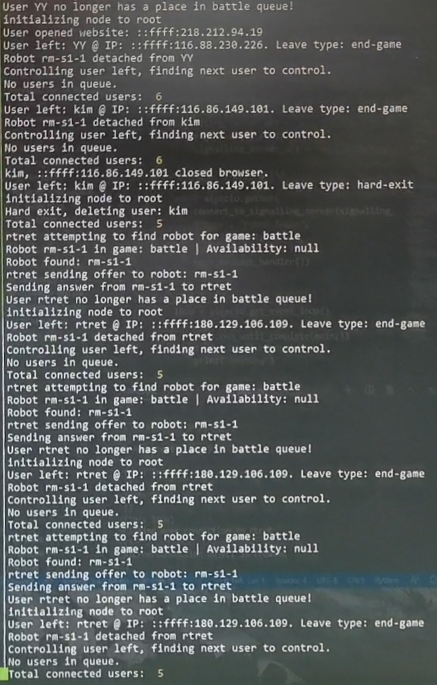

# WebRTC Signalling Server for Real-Time Robot Control 

## Overview of Project
This repository is part of the **Online Robot Remote Control** project where users can log in to a website to remotely control one of any number of robots in a fleet from the comfort of their homes using WebRTC. 

    

This repository contains the Signalling Server, which handles signalling for webRTC connection requests from a client on a device to a remotely controlled robot. This involves managing the offers and answers sent between the frontend instances and the available robots. It also managed the queueing of the users as they wait for their turn to control a robot.

    

#### Other Repositories
- [Frontend](https://github.com/nusrobomaster/NUS_RoboMaster_Interactive_Showcase)
- [Robot Control](https://github.com/nusrobomaster/RoboMaster_S1_Web_Remote)

## Setup for Full Signalling Server

- Install nodejs
- Setup TURN server using coTURN with the [following instructions](https://ourcodeworld.com/articles/read/1175/how-to-create-and-configure-your-own-stun-turn-server-with-coturn-in-ubuntu-18-04).
    - This is needed by webRTC to go through firewalls. Both the client frontend and robot need to know the IP:port for this server
- Run the script using the `node server.js` command

## Setup for Local Testing
- Only requires running the script using `node server.js`

## Function Reference

### `robotLoginHandler(data, connection)`

**Use**
When a robot switches on, it sends a connection request that triggers this function. The function saves the robot information in an object/map called `connectedRobots` with the `key` as the robot name and the `value` being the robot `connection` object. It also appends a `joinedGame` parameter to the `connection` object to signify which game this robot is available to clients under.

**Parameters**
`data`: Object of format: 
    
    { 
        type: "robot-login", 
        name: <RobotNameString>,        // Unique identifier for robot
        joinedGame: "<GameNameString>   // Which game this robot will be available under
    }

`connection`: The robot connection object returned by WebSocket

---

### `userLoginHandler(data, connection)`
**Use**
When a client logs into the frontend from their browser, this function is called. It stores the client data in an object/map called `connectedUsers` with the `key` as the user name and the `value` being the user `connection` object. This data is later used by other functions to link up a robot and client together in a webRTC stream. It also performs a check if a user has entered a duplicate username as another user already connected.

**Parameters**
`data`: Object of format: 
    
    { 
        type: "user-login",     
        name: <UserNameString>, // Unique identifier for user (previously entered by user in frontend)
    }

`connection`: The user connection object returned by WebSocket

---

The other functions follow the same design pattern as above, where they are called from a single `switch/case` statement depending on what query the user has entered. 

